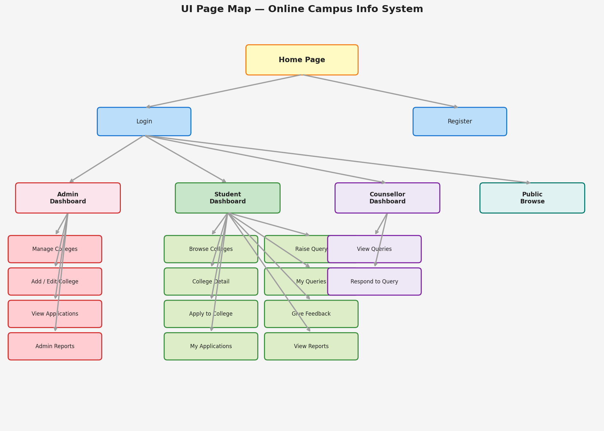
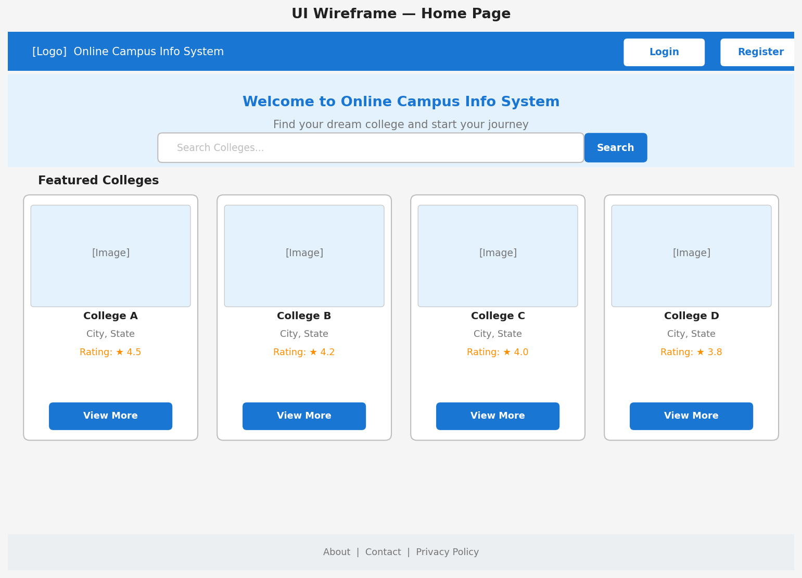
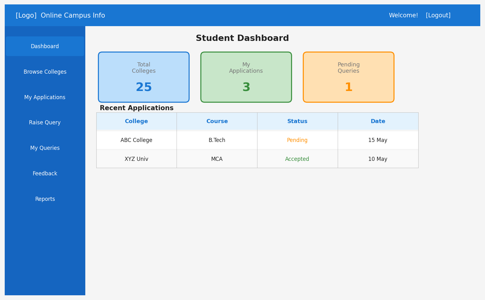
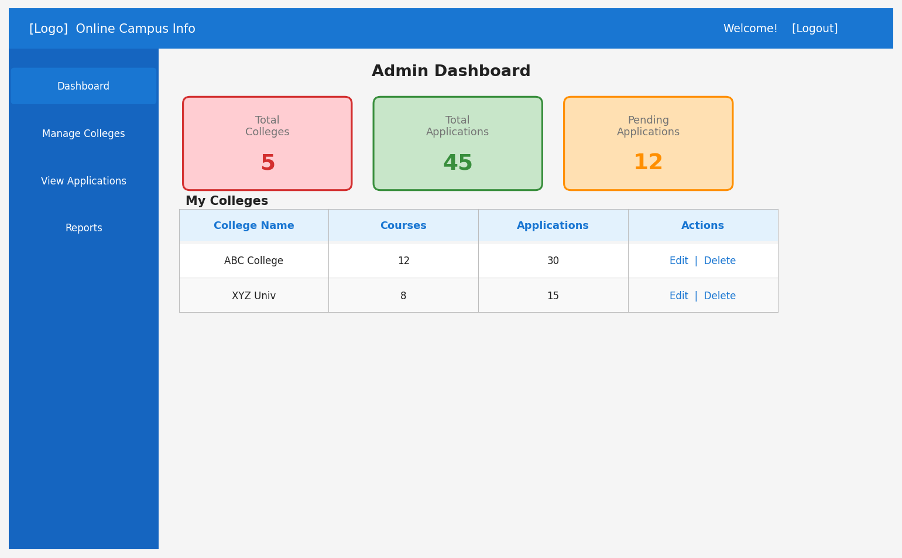
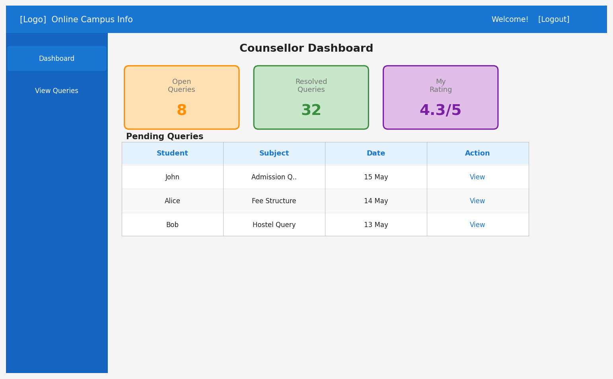

# Online Campus Info System - UI Wireframes & Page Descriptions

## Page Map Overview



<details>
<summary>Text representation</summary>

```
                            +------------------+
                            |    Home Page     |
                            +------------------+
                                    |
                 +------------------+------------------+
                 |                                     |
          +------+------+                      +------+------+
          |   Login     |                      |  Register   |
          +-------------+                      +-------------+
                 |
    +------------+------------+------------------+
    |            |            |                   |
+---+---+  +----+----+  +----+----+         +----+----+
| Admin |  | Student |  |Counsellor|         |  Public |
|Dashboard| |Dashboard| |Dashboard |         | Browse  |
+---+---+  +----+----+  +----+----+         +---------+
    |            |            |
    |            |            +-- View Queries
    |            |            +-- Respond to Queries
    |            |
    |            +-- Browse Colleges
    |            +-- College Detail
    |            +-- Apply to College
    |            +-- My Applications
    |            +-- Raise Query
    |            +-- My Queries
    |            +-- Give Feedback
    |            +-- View Reports
    |
    +-- Manage Colleges (CRUD)
    +-- Add/Edit College
    +-- View Applications
    +-- View Reports
```

</details>

---

## 1. Home Page



<details>
<summary>Text representation</summary>

```
+------------------------------------------------------------------+
|  [Logo] Online Campus Info System          [Login] [Register]     |
+------------------------------------------------------------------+
|                                                                    |
|              Welcome to Online Campus Info System                  |
|         Find your dream college and start your journey            |
|                                                                    |
|         [Search Colleges...                    ] [Search]          |
|                                                                    |
+------------------------------------------------------------------+
|                                                                    |
|  Featured Colleges                                                |
|  +------------+  +------------+  +------------+  +------------+   |
|  | [Image]    |  | [Image]    |  | [Image]    |  | [Image]    |   |
|  | College A  |  | College B  |  | College C  |  | College D  |   |
|  | Location   |  | Location   |  | Location   |  | Location   |   |
|  | Rating:4.5 |  | Rating:4.2 |  | Rating:4.0 |  | Rating:3.8 |   |
|  | [View More]|  | [View More]|  | [View More]|  | [View More]|   |
|  +------------+  +------------+  +------------+  +------------+   |
|                                                                    |
+------------------------------------------------------------------+
|  [Footer: About | Contact | Privacy Policy]                       |
+------------------------------------------------------------------+
```

</details>

---

## 2. Login Page

```
+------------------------------------------------------------------+
|  [Logo] Online Campus Info System                    [Home]        |
+------------------------------------------------------------------+
|                                                                    |
|                   +---------------------------+                    |
|                   |         LOGIN             |                    |
|                   +---------------------------+                    |
|                   |                           |                    |
|                   |  Email:                   |                    |
|                   |  [____________________]   |                    |
|                   |                           |                    |
|                   |  Password:                |                    |
|                   |  [____________________]   |                    |
|                   |                           |                    |
|                   |  [      LOGIN        ]    |                    |
|                   |                           |                    |
|                   |  Don't have account?      |                    |
|                   |  [Register here]          |                    |
|                   +---------------------------+                    |
|                                                                    |
+------------------------------------------------------------------+
```

---

## 3. Registration Page

```
+------------------------------------------------------------------+
|  [Logo] Online Campus Info System                    [Home]        |
+------------------------------------------------------------------+
|                                                                    |
|                   +---------------------------+                    |
|                   |       REGISTER           |                    |
|                   +---------------------------+                    |
|                   |                           |                    |
|                   |  Full Name:               |                    |
|                   |  [____________________]   |                    |
|                   |                           |                    |
|                   |  Email:                   |                    |
|                   |  [____________________]   |                    |
|                   |                           |                    |
|                   |  Password:                |                    |
|                   |  [____________________]   |                    |
|                   |                           |                    |
|                   |  Phone:                   |                    |
|                   |  [____________________]   |                    |
|                   |                           |                    |
|                   |  Role:                    |                    |
|                   |  ( ) Student              |                    |
|                   |  ( ) Admin                |                    |
|                   |  ( ) Counsellor           |                    |
|                   |                           |                    |
|                   |  [     REGISTER      ]    |                    |
|                   |                           |                    |
|                   |  Already have account?    |                    |
|                   |  [Login here]             |                    |
|                   +---------------------------+                    |
|                                                                    |
+------------------------------------------------------------------+
```

---

## 4. Student Dashboard



<details>
<summary>Text representation</summary>

```
+------------------------------------------------------------------+
|  [Logo]  Online Campus Info       Welcome, John!  [Logout]        |
+------------------------------------------------------------------+
|  [Sidebar]     |                                                  |
|                |   STUDENT DASHBOARD                              |
|  Dashboard     |                                                  |
|  Browse        |   +----------+  +----------+  +----------+      |
|   Colleges     |   | Total    |  | My       |  | Pending  |      |
|  My            |   | Colleges |  | Apps     |  | Queries  |      |
|   Applications |   |   25     |  |    3     |  |    1     |      |
|  Raise Query   |   +----------+  +----------+  +----------+      |
|  My Queries    |                                                  |
|  Feedback      |   Recent Applications                            |
|  Reports       |   +------------------------------------------+  |
|                |   | College    | Course  | Status   | Date    |  |
|                |   |------------|---------|----------|---------|  |
|                |   | ABC College| B.Tech  | Pending  | 15 May  |  |
|                |   | XYZ Univ   | MCA     | Accepted | 10 May  |  |
|                |   +------------------------------------------+  |
|                |                                                  |
+------------------------------------------------------------------+
```

</details>

---

## 5. Browse Colleges Page (Student)

```
+------------------------------------------------------------------+
|  [Logo]  Online Campus Info       Welcome, John!  [Logout]        |
+------------------------------------------------------------------+
|  [Sidebar]     |                                                  |
|                |   BROWSE COLLEGES                                |
|                |                                                  |
|                |   [Search...        ] [City: v] [Course: v]      |
|                |                                                  |
|                |   +--------------------------------------------+ |
|                |   | [Image]  ABC Engineering College            | |
|                |   |          Location: Bangalore, Karnataka     | |
|                |   |          Established: 1995 | Strength: 5000 | |
|                |   |          Courses: 12 | Rating: 4.5 stars    | |
|                |   |          [View Details]  [Apply Now]        | |
|                |   +--------------------------------------------+ |
|                |                                                  |
|                |   +--------------------------------------------+ |
|                |   | [Image]  XYZ University                    | |
|                |   |          Location: Chennai, Tamil Nadu      | |
|                |   |          Established: 2001 | Strength: 3000 | |
|                |   |          Courses: 8 | Rating: 4.0 stars     | |
|                |   |          [View Details]  [Apply Now]        | |
|                |   +--------------------------------------------+ |
|                |                                                  |
|                |   [< Prev]  Page 1 of 3  [Next >]               |
+------------------------------------------------------------------+
```

---

## 6. College Detail Page

```
+------------------------------------------------------------------+
|  [Logo]  Online Campus Info       Welcome, John!  [Logout]        |
+------------------------------------------------------------------+
|  [Sidebar]     |                                                  |
|                |   ABC ENGINEERING COLLEGE                        |
|                |   Location: Bangalore | Est: 1995 | Rating: 4.5 |
|                |                                                  |
|                |   [Image Gallery: img1 | img2 | img3 | img4]    |
|                |                                                  |
|                |   ABOUT                                          |
|                |   Premier engineering institution offering...    |
|                |                                                  |
|                |   COURSES AVAILABLE                              |
|                |   +------------------------------------------+  |
|                |   | Course    | Duration | Seats | Fee      |  |
|                |   |-----------|----------|-------|----------|  |
|                |   | B.Tech CS | 4 years  | 120   | 80,000   |  |
|                |   | B.Tech EC | 4 years  | 60    | 75,000   |  |
|                |   | MCA       | 2 years  | 60    | 60,000   |  |
|                |   +------------------------------------------+  |
|                |                                                  |
|                |   FACILITIES                                     |
|                |   +--------+ +--------+ +--------+ +--------+   |
|                |   |  Lab   | |Library | | Sports | | Hostel |   |
|                |   | 5 labs | |50K bks | |Ground  | |500 cap |   |
|                |   +--------+ +--------+ +--------+ +--------+   |
|                |                                                  |
|                |   ELIGIBILITY CRITERIA                            |
|                |   - Minimum 60% in 12th standard                |
|                |   - Valid entrance exam score                    |
|                |                                                  |
|                |   [Apply to this College]  [Give Feedback]       |
|                |                                                  |
|                |   STUDENT FEEDBACK (25 reviews)                  |
|                |   +------------------------------------------+  |
|                |   | Student A | 4 stars | "Great campus..."  |  |
|                |   | Student B | 5 stars | "Excellent labs"   |  |
|                |   +------------------------------------------+  |
+------------------------------------------------------------------+
```

---

## 7. Application Form Page

```
+------------------------------------------------------------------+
|  [Logo]  Online Campus Info       Welcome, John!  [Logout]        |
+------------------------------------------------------------------+
|  [Sidebar]     |                                                  |
|                |   APPLY TO: ABC Engineering College              |
|                |                                                  |
|                |   +------------------------------------------+  |
|                |   | ADMISSION APPLICATION FORM               |  |
|                |   +------------------------------------------+  |
|                |   |                                          |  |
|                |   | Select Course:                           |  |
|                |   | [Dropdown: B.Tech CS / B.Tech EC / MCA] |  |
|                |   |                                          |  |
|                |   | Full Name:  [_________________________] |  |
|                |   | Email:      [_________________________] |  |
|                |   | Phone:      [_________________________] |  |
|                |   | Qualification: [_____________________]  |  |
|                |   | Percentage:    [_____]                   |  |
|                |   | Address:                                 |  |
|                |   | [________________________________]       |  |
|                |   | [________________________________]       |  |
|                |   |                                          |  |
|                |   | Statement of Purpose:                    |  |
|                |   | [________________________________]       |  |
|                |   | [________________________________]       |  |
|                |   | [________________________________]       |  |
|                |   |                                          |  |
|                |   | [     SUBMIT APPLICATION     ]          |  |
|                |   +------------------------------------------+  |
+------------------------------------------------------------------+
```

---

## 8. Admin Dashboard



<details>
<summary>Text representation</summary>

```
+------------------------------------------------------------------+
|  [Logo]  Online Campus Info       Welcome, Admin!  [Logout]       |
+------------------------------------------------------------------+
|  [Sidebar]     |                                                  |
|                |   ADMIN DASHBOARD                                |
|  Dashboard     |                                                  |
|  Manage        |   +----------+  +----------+  +----------+      |
|   Colleges     |   | Total    |  | Total    |  | Pending  |      |
|  View          |   | Colleges |  | Apps     |  | Apps     |      |
|   Applications |   |    5     |  |   45     |  |   12     |      |
|  Reports       |   +----------+  +----------+  +----------+      |
|                |                                                  |
|                |   My Colleges                                    |
|                |   +------------------------------------------+  |
|                |   | College Name  | Courses | Apps | Actions |  |
|                |   |---------------|---------|------|---------|  |
|                |   | ABC College   |   12    |  30  |[Edit][X]|  |
|                |   | XYZ Univ      |    8    |  15  |[Edit][X]|  |
|                |   +------------------------------------------+  |
|                |                                                  |
|                |   [+ Add New College]                            |
+------------------------------------------------------------------+
```

</details>

---

## 9. Counsellor Dashboard



<details>
<summary>Text representation</summary>

```
+------------------------------------------------------------------+
|  [Logo]  Online Campus Info    Welcome, Counsellor!  [Logout]     |
+------------------------------------------------------------------+
|  [Sidebar]     |                                                  |
|                |   COUNSELLOR DASHBOARD                           |
|  Dashboard     |                                                  |
|  View Queries  |   +----------+  +----------+  +----------+      |
|                |   | Open     |  | Resolved |  | My       |      |
|                |   | Queries  |  | Queries  |  | Rating   |      |
|                |   |    8     |  |   32     |  |  4.3/5   |      |
|                |   +----------+  +----------+  +----------+      |
|                |                                                  |
|                |   Pending Queries                                |
|                |   +------------------------------------------+  |
|                |   | Student  | Subject       | Date  |Action |  |
|                |   |----------|---------------|-------|-------|  |
|                |   | John     | Admission Q.. | 15May |[View] |  |
|                |   | Alice    | Fee Structure | 14May |[View] |  |
|                |   | Bob      | Hostel Query  | 13May |[View] |  |
|                |   +------------------------------------------+  |
+------------------------------------------------------------------+
```

</details>

---

## 10. Reports Page

```
+------------------------------------------------------------------+
|  [Logo]  Online Campus Info       Welcome, John!  [Logout]        |
+------------------------------------------------------------------+
|  [Sidebar]     |                                                  |
|                |   REPORTS & COMPARISON                           |
|                |                                                  |
|                |   College Feedback Comparison                    |
|                |   +------------------------------------------+  |
|                |   |  [Bar Chart]                             |  |
|                |   |                                          |  |
|                |   |  ABC  |========== 4.5                    |  |
|                |   |  XYZ  |========  4.0                     |  |
|                |   |  PQR  |======  3.5                       |  |
|                |   |  LMN  |=====  3.2                        |  |
|                |   +------------------------------------------+  |
|                |                                                  |
|                |   Counsellor Performance                         |
|                |   +------------------------------------------+  |
|                |   | Counsellor | Queries | Avg Rating| Resolved| |
|                |   |------------|---------|-----------|---------|  |
|                |   | Counsellor1|   32    |   4.3     |   30    |  |
|                |   | Counsellor2|   28    |   4.1     |   25    |  |
|                |   +------------------------------------------+  |
|                |                                                  |
|                |   [Download Report as PDF]                       |
+------------------------------------------------------------------+
```

---

## 11. Raise Query Page (Student)

```
+------------------------------------------------------------------+
|  [Logo]  Online Campus Info       Welcome, John!  [Logout]        |
+------------------------------------------------------------------+
|  [Sidebar]     |                                                  |
|                |   RAISE A QUERY                                  |
|                |                                                  |
|                |   +------------------------------------------+  |
|                |   |                                          |  |
|                |   | Related College (optional):              |  |
|                |   | [Dropdown: Select College       v]      |  |
|                |   |                                          |  |
|                |   | Subject:                                 |  |
|                |   | [________________________________]       |  |
|                |   |                                          |  |
|                |   | Your Query:                              |  |
|                |   | [________________________________]       |  |
|                |   | [________________________________]       |  |
|                |   | [________________________________]       |  |
|                |   | [________________________________]       |  |
|                |   |                                          |  |
|                |   | [     SUBMIT QUERY     ]                |  |
|                |   +------------------------------------------+  |
+------------------------------------------------------------------+
```

---

## 12. Feedback Form Page (Student)

```
+------------------------------------------------------------------+
|  [Logo]  Online Campus Info       Welcome, John!  [Logout]        |
+------------------------------------------------------------------+
|  [Sidebar]     |                                                  |
|                |   GIVE FEEDBACK                                  |
|                |                                                  |
|                |   +------------------------------------------+  |
|                |   |                                          |  |
|                |   | Feedback Type:                           |  |
|                |   | ( ) College Feedback                     |  |
|                |   | ( ) Counsellor Feedback                  |  |
|                |   |                                          |  |
|                |   | Select College/Counsellor:               |  |
|                |   | [Dropdown: Select...             v]     |  |
|                |   |                                          |  |
|                |   | Rating:                                  |  |
|                |   | [star][star][star][star][star]           |  |
|                |   |                                          |  |
|                |   | Comments:                                |  |
|                |   | [________________________________]       |  |
|                |   | [________________________________]       |  |
|                |   |                                          |  |
|                |   | [     SUBMIT FEEDBACK     ]             |  |
|                |   +------------------------------------------+  |
+------------------------------------------------------------------+
```

---

## Color Theme & Design Guidelines

| Element | Color | Usage |
|---------|-------|-------|
| Primary | #1976D2 (Blue) | Buttons, Headers, Links |
| Secondary | #388E3C (Green) | Success messages, Accept |
| Danger | #D32F2F (Red) | Delete, Reject, Errors |
| Warning | #F57C00 (Orange) | Pending status |
| Background | #F5F5F5 (Light Gray) | Page background |
| Card BG | #FFFFFF (White) | Cards, Forms |
| Text | #212121 (Dark Gray) | Body text |
| Muted | #757575 (Gray) | Secondary text |

### Typography
- Headings: Roboto / Inter (Bold)
- Body: Roboto / Inter (Regular)
- Font sizes: H1(28px), H2(24px), H3(20px), Body(16px), Small(14px)

### Component Styles
- Border radius: 8px for cards, 4px for inputs
- Shadow: Light box-shadow on cards
- Spacing: 16px padding, 24px gaps between sections
- Responsive: Mobile-first, breakpoints at 768px and 1024px
